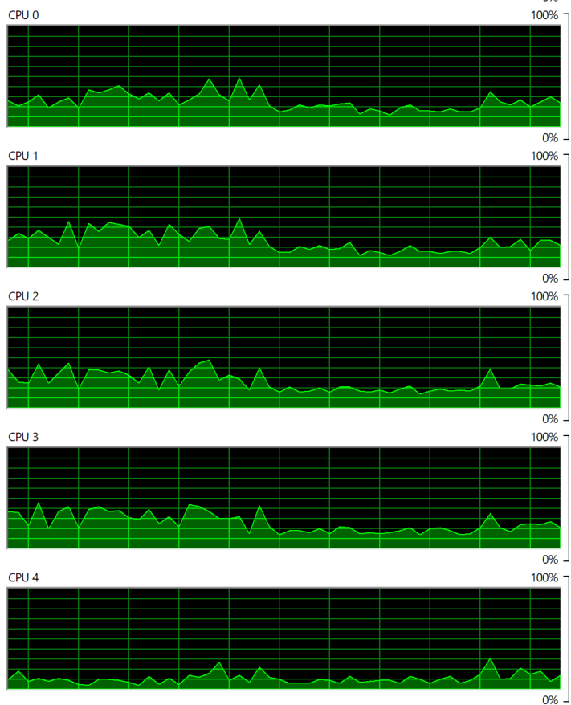

# Multi Threading

## Overview

This notebook implements multi-threading technique on various number of cores.
The notebook includes the following steps:

  1. Getting number of cores
  2. Creating 2 times the number of threads as compared to core
  3. Using different number of threads to see the time variation in doing the same task.

## Methodology

  1. Import Libraries:
  * The necessary libraries are imported, including multiprocessing, threading, numpy, and time.
  2. Determine Number of CPU Cores:
  * The number of CPU cores available in the system is determined using the multiprocessing.cpu_count() function.
  3. Define Matrix Multiplication Function:
    The matrix_multiply function is defined to perform matrix multiplication.
  * It takes input matrices (matrix and constant_matrix), result storage (result), and an index.
  * It checks if the matrices are compatible for multiplication.
  * It initializes a result matrix with zeros and performs matrix multiplication using nested loops.
  4. Generate Random Matrices:
   * Random matrices (matrices) of size 100x100 are generated for demonstration purposes.
   * A constant matrix (constant_matrix) of the same size is also generated.
  5. Perform Matrix Multiplication with Threading:
  * The code iterates over different numbers of threads (from 1 to 11).
  * For each iteration, it starts multiple threads to perform matrix multiplication tasks in parallel.
  * The number of active threads is controlled to match the specified number of threads.
  * The total time taken for matrix multiplication with the current number of threads is measured.
  6. Output Results:
  * The total time taken for matrix multiplication with each configuration of threads is printed.
  * The results are stored in the timelist list for further analysis.


## Dependencies
  
  * Jupyter Notebook/ Google Collab
  * multiprocessing
  * threading
  * numpy
  * os
  * sys
  * time
  * random

You can install the required dependencies using pip:
```
pip install jupyter multiprocessing threading numpy os sys time random
```

## Output Table
| Threads  | T = 1 | T = 2 | T = 3 | T = 4 | T = 5 | T = 6 | T = 7 | T = 8 | T = 9 | T = 10 | T = 11 |
| ------------- | ------------- | ------------- | ------------- | ------------- | ------------- | ------------- | ------------- | ------------- | ------------- | ------------- | ------------- |
| Time Taken (secs)  | 117 | 112 | 

## Picture of Resource Monitor



## Files Included 

  1. Multi_Threading.ipynb: Jupyter notebook containg the code for the above mentioned
  1. ReadMe.md: This file provides an overview of the code
     
